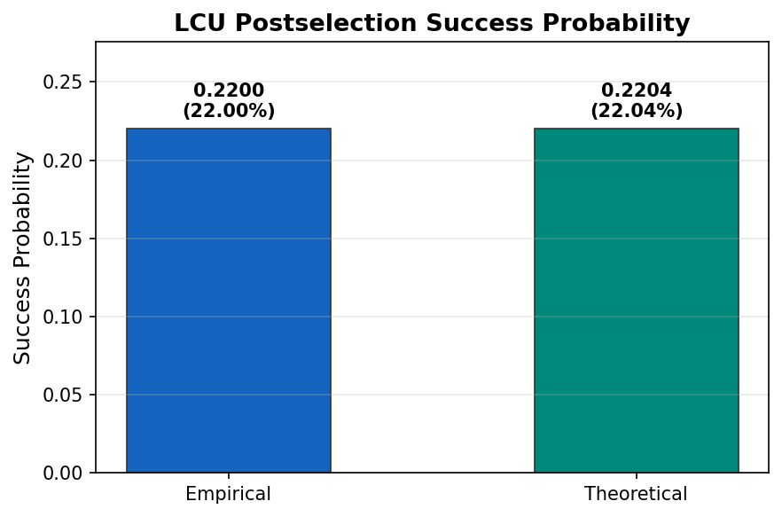

# Linear Combination of Unitaries (LCU) - Quantum Circuit Implementation

This repository contains my implementation of the Linear Combination of Unitaries (LCU) technique using Qiskit. The LCU method is a fundamental approach in quantum algorithms for representing operators as linear combinations of unitary matrices, which is particularly useful in quantum simulation and quantum machine learning applications.

## Table of Contents
- [Overview](#overview)
- [Theory](#theory)
- [Implementation](#implementation)
- [Circuit Architecture](#circuit-architecture)
- [Results](#results)
- [Requirements](#requirements)
- [Usage](#usage)
- [References](#references)

## Overview

The Linear Combination of Unitaries (LCU) is a powerful quantum algorithmic technique that allows us to implement non-unitary operations on quantum computers through a probabilistic process. This implementation demonstrates the construction and execution of an LCU circuit with state preparation using both abstract and decomposed approaches.

**Key Features:**
- Complete LCU circuit implementation with ancilla-based control
- Two state preparation methods: abstract and RY/CX decomposed
- Postselection-based measurement protocol
- Empirical validation matching theoretical predictions

## Theory

### Linear Combination of Unitaries

The LCU technique allows us to implement an operator $A$ that can be decomposed as a linear combination of unitary operators:

$$
A = \sum_{j=0}^{L-1} \alpha_j U_j
$$

where $\alpha_j \geq 0$ are real coefficients and $U_j$ are unitary operators.

### Normalization

To work with this decomposition on a quantum computer, we normalize the coefficients:

$$
\sum_{j=0}^{L-1} \alpha_j = \alpha
$$

and define normalized probabilities:

$$
p_j = \frac{\alpha_j}{\alpha}
$$

such that $\sum_{j=0}^{L-1} p_j = 1$.

### LCU 

The LCU consists of three main steps:

1. **State Preparation**: Prepare an ancilla register in the state
   $ |0\rangle \rightarrow \sum_{j=0}^{L-1} \sqrt{p_j} |j\rangle $

2. **Controlled Unitaries**: Apply controlled-$U_j$ operations conditioned on the ancilla state $|j\rangle$

3. **Uncomputation & Postselection**: Reverse the state preparation and measure the ancilla. Success occurs when measuring $|0\rangle$.

### Success Probability

The theoretical success probability of the LCU protocol is given by:

$$
P_{\text{success}} = \frac{1}{\alpha^2} = \frac{1}{\left(\sum_{j=0}^{L-1} \alpha_j\right)^2}
$$

For my implementation, the theoretical success probability is **22.04%**, which matches closely with the empirical results.

## Implementation

### Circuit Components

The implementation consists of several key components:

1. **Ancilla Register**: Used for state preparation and postselection
2. **System Register**: Contains the quantum state on which we apply the operator
3. **State Preparation Block**: Prepares the superposition state encoding the coefficients $\sqrt{p_j}$
4. **SELECT Operation**: Applies the appropriate unitary $U_j$ based on the ancilla state
5. **Measurement & Postselection**: Measures ancilla qubits and accepts only when all are $|0\rangle$

### State Preparation Methods

I implemented two approaches for state preparation:

#### Method 1: Abstract State Preparation
Uses Qiskit's built-in `StatePreparation` gate for preparing the coefficient superposition state. This provides a compact circuit representation.

#### Method 2: Decomposed RY/CX State Preparation
Manually decomposes the state preparation into elementary RY (rotation) and CX (CNOT) gates. This approach:
- Provides explicit control over gate decomposition
- Enables better understanding of circuit depth and structure
- Allows for hardware-specific optimization

The decomposition uses uniformly controlled rotations:

$$
\text{StatePrep}(|\psi\rangle) = \prod_{k} \text{UCRy}(\theta_k) \cdot \text{CX}_k
$$

## Circuit Architecture

### Full LCU Circuit Structure

```
Ancilla Qubits    [State Prep] ──●──●──●── [State Prep†] ── Measure
                                 │  │  │
System Qubits     ──────────────[U₀][U₁][Uⱼ]────────────────────────
```

### Visualization

The repository includes two circuit visualizations:

1. **LCU with Abstract State Preparation** (`lcu_circuit.png`)
   - Shows the high-level circuit structure
   - State preparation as a single block
   
2. **LCU with Decomposed State Preparation** (`lcu_circuit_with_rycx_stateprep.png`)
   - Shows the explicit RY and CX gate decomposition
   - Demonstrates the full gate-level implementation

## Results

### Experimental Configuration

I tested the LCU implementation with the following configuration:

**Operator Decomposition:**
$$
A =
0.3\,(X \otimes X \otimes X \otimes X \otimes Y)
+ 0.89\,(X \otimes Y \otimes Z \otimes Z \otimes Y)
+ 0.99\,(Y \otimes Y \otimes X \otimes X \otimes I)
+ 0.88\,(Y \otimes X \otimes Y \otimes X \otimes Z)
+ 0.98\,(X \otimes Y \otimes Y \otimes Z \otimes I)
$$


**Implementation Parameters:**
```python
coefficients = [0.3, 0.89, 0.99, 0.88, 0.98]
unitaries    = ["XXXXY", "XYZZY", "YYXXI", "YXYXZ", "XYYZI"]
initial_state = "00000+10101+00100+11111"
shots = 20000
normalize_coeffs_l2 = True
```

### Success Probability Validation

I validated my implementation by comparing empirical results with theoretical predictions:

| Method | Success Probability |
|--------|-------------------|
| **Empirical** | 22.00% |
| **Theoretical** | 22.04% |

The close match between empirical and theoretical values confirms the correctness of the implementation.



### Performance Metrics

- **Circuit Depth**: Varies based on state preparation method
- **Gate Count**: Optimized for the specific LCU decomposition
- **Execution Time**: Dependent on the number of shots and backend

## Requirements

```
qiskit >= 0.45.0
qiskit-aer >= 0.13.0
numpy >= 1.24.0
matplotlib >= 3.7.0
```

## Usage

### Basic Example

```python
from qiskit import QuantumCircuit, QuantumRegister, ClassicalRegister
from qiskit_aer import AerSimulator
from qiskit.visualization import plot_histogram

# Define your LCU parameters
alphas = [...]  # Coefficients for linear combination
unitaries = [...]  # List of unitary operators

# Create LCU circuit
qc = create_lcu_circuit(alphas, unitaries)

# Execute on simulator
simulator = AerSimulator()
job = simulator.run(qc, shots=10000)
result = job.result()
counts = result.get_counts()

# Postselect on ancilla = |0⟩
success_counts = postselect_ancilla_zero(counts)
success_probability = calculate_success_probability(success_counts)
```

### Running the Full Implementation

```python
# Run with abstract state preparation
python main.py

# Run with decomposed state preparation
python main_stateprep_decomposed.py
```

## Circuit Details

### Ancilla-Controlled Operations

The SELECT oracle applies the appropriate unitary based on the ancilla register state:

$$
\text{SELECT} = \sum_{j=0}^{L-1} |j\rangle\langle j| \otimes U_j
$$

This is implemented using multi-controlled gates where each unitary $U_j$ is applied when the ancilla register encodes the binary representation of $j$.

### Postselection Process

After running the circuit, measurements are filtered to accept only outcomes where all ancilla qubits are measured as $|0\rangle$:

$$
P(\text{ancilla} = |0\rangle) = P_{\text{success}}
$$

The postselected state on the system register approximates the desired non-unitary operation.

## Key Implementation Insights

1. **Coefficient Encoding**: The square roots of normalized coefficients are encoded in the state preparation amplitudes
2. **Controlled Unitaries**: Each unitary in the decomposition is applied conditionally based on the ancilla state
3. **Success Amplification**: While the success probability is ~22%, this can be improved using amplitude amplification techniques
4. **Gate Optimization**: The decomposed version allows for circuit optimization based on hardware topology

## Mathematical Foundation

The action of the LCU circuit on the system state $|\psi\rangle$ can be written as:

$$
\langle 0|_{\text{anc}} \text{LCU} |0\rangle_{\text{anc}} |\psi\rangle_{\text{sys}} = \frac{1}{\alpha} \sum_{j=0}^{L-1} \alpha_j U_j |\psi\rangle_{\text{sys}}
$$

where the normalization factor $1/\alpha$ appears due to the postselection on $|0\rangle_{\text{anc}}$.


## References

1. Berry, D. W., Childs, A. M., Cleve, R., Kothari, R., & Somma, R. D. (2015). Simulating Hamiltonian dynamics with a truncated Taylor series. *Physical Review Letters*, 114(9), 090502.

2. Childs, A. M., & Wiebe, N. (2012). Hamiltonian simulation using linear combinations of unitary operations. *Quantum Information & Computation*, 12(11-12), 901-924.

3. Low, G. H., & Chuang, I. L. (2017). Optimal Hamiltonian simulation by quantum signal processing. *Physical Review Letters*, 118(10), 100501.

4. Qiskit Documentation: https://qiskit.org/documentation/

## License

This project is licensed under the MIT License - see the LICENSE file for details.

## Acknowledgments

This implementation was developed as part of my exploration into quantum algorithms and their practical implementation using Qiskit. Special thanks to the quantum computing community for the extensive resources and documentation.

---

**Author**: **Tilock Sadhukhan** [LinkdIn](https://www.linkedin.com/in/tilock-sadhukhan/)
**Last Updated**: February 2026
